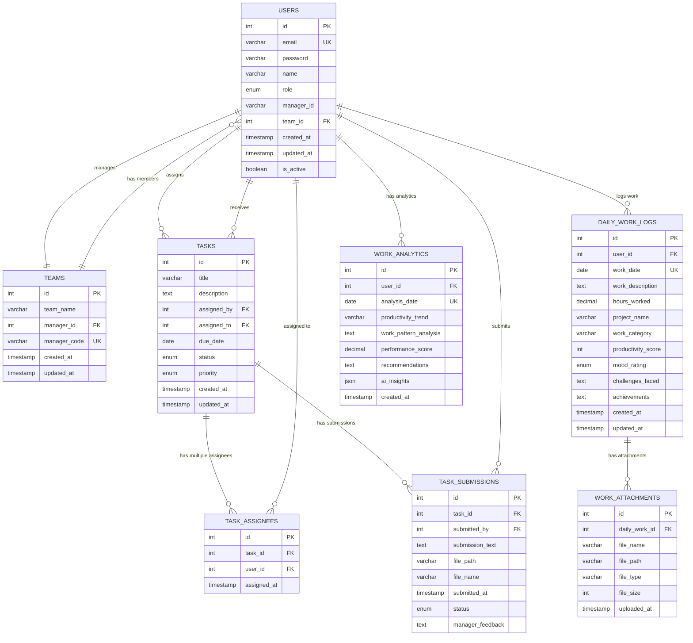

# Team Management System - Database ER Diagram

## 📊 Entity Relationship Diagram



## 📋 Detailed Table Descriptions

### 1. **USERS** (Core user management)
- **Purpose**: Stores all system users (managers and employees)
- **Key Features**:
  - Role-based access (manager/employee)
  - Team membership via `team_id`
  - Manager code for team joining
  - Account status management

### 2. **TEAMS** (Team organization)
- **Purpose**: Organizes users into teams with unique manager codes
- **Key Features**:
  - Each team has one manager
  - Unique manager codes for employee joining
  - Team name and creation tracking

### 3. **TASKS** (Task management)
- **Purpose**: Core task assignment and tracking
- **Key Features**:
  - Manager assigns tasks to employees
  - Status tracking (pending, in_progress, completed, overdue)
  - Priority levels (low, medium, high, urgent)
  - Due date management

### 4. **TASK_ASSIGNEES** (Multi-assignee support)
- **Purpose**: Enables multiple people to be assigned to one task
- **Key Features**:
  - Many-to-many relationship between tasks and users
  - Assignment timestamp tracking
  - Supports collaborative tasks

### 5. **TASK_SUBMISSIONS** (Work proof)
- **Purpose**: Stores employee task completion submissions
- **Key Features**:
  - Text descriptions of completed work
  - File attachments support
  - Manager feedback system
  - Submission status tracking

### 6. **DAILY_WORK_LOGS** (Daily productivity tracking)
- **Purpose**: Employee daily work logging
- **Key Features**:
  - Daily work descriptions and hours
  - Project categorization
  - Mood and productivity tracking
  - Achievements and challenges logging

### 7. **WORK_ATTACHMENTS** (File management)
- **Purpose**: Manages file uploads for daily work
- **Key Features**:
  - File metadata storage
  - Multiple files per work entry
  - File type and size tracking

### 8. **WORK_ANALYTICS** (Future AI insights)
- **Purpose**: Stores AI-generated work analytics
- **Key Features**:
  - Performance scoring
  - Productivity trends
  - AI recommendations
  - JSON storage for flexible insights

## 🔗 Key Relationships

### **Team Structure**:
```
TEAMS (1) ←→ (Many) USERS
- One team has many users
- One user belongs to one team
- Manager relationship via manager_id
```

### **Task Assignment**:
```
USERS (1) ←→ (Many) TASKS (assigned_by)
TASKS (Many) ←→ (Many) USERS (via TASK_ASSIGNEES)
- Managers assign tasks
- Tasks can have multiple assignees
- Employees receive multiple tasks
```

### **Work Tracking**:
```
USERS (1) ←→ (Many) DAILY_WORK_LOGS
DAILY_WORK_LOGS (1) ←→ (Many) WORK_ATTACHMENTS
- Users log daily work
- Work entries can have multiple file attachments
```

### **Task Completion**:
```
TASKS (1) ←→ (Many) TASK_SUBMISSIONS
USERS (1) ←→ (Many) TASK_SUBMISSIONS
- Tasks can have multiple submissions (revisions)
- Users can submit work for multiple tasks
```

## 🎯 Database Design Principles

### **Normalization**:
- ✅ **1NF**: All attributes are atomic
- ✅ **2NF**: No partial dependencies
- ✅ **3NF**: No transitive dependencies
- ✅ **BCNF**: Proper key relationships

### **Scalability Features**:
- **Indexes**: On foreign keys and frequently queried columns
- **Constraints**: Foreign key constraints for data integrity
- **Unique Keys**: Prevent duplicate data
- **Timestamps**: Track creation and modification times

### **Security Features**:
- **Password Hashing**: Stored securely with bcrypt
- **Role-based Access**: Manager/Employee separation
- **Team Isolation**: Users only see their team data
- **File Validation**: Secure file upload handling

### **Performance Optimizations**:
- **Composite Indexes**: On frequently joined columns
- **Query Optimization**: Efficient JOIN operations
- **Connection Pooling**: Database connection management
- **Transaction Management**: ACID compliance

## 📈 Data Flow Examples

### **User Registration Flow**:
1. Manager signs up → Creates USERS record → Creates TEAMS record → Generates manager_code
2. Employee signs up → Creates USERS record → Links to existing TEAMS via manager_code

### **Task Management Flow**:
1. Manager creates task → TASKS record → TASK_ASSIGNEES records for multiple assignees
2. Employee submits work → TASK_SUBMISSIONS record → Updates task status
3. System sends notifications → NOTIFICATIONS records

### **Daily Work Flow**:
1. Employee logs work → DAILY_WORK_LOGS record
2. Uploads files → WORK_ATTACHMENTS records
3. Manager views team work → Queries across tables with JOINs

This database structure supports your complete team management system with scalability, security, and performance in mind! 🚀